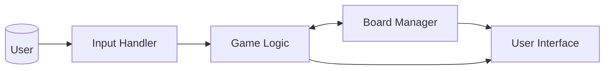
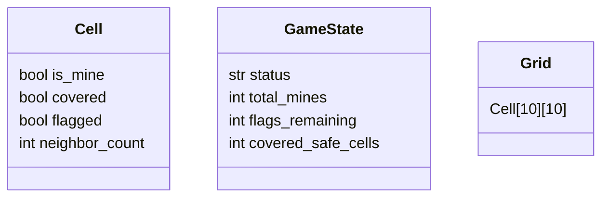

## Minesweeper - System Architecture Overview

This documentation gives a high-level overview of our implementation of Minesweeper in Python using Pygame. Our design will use a 10x10 grid with 10-20 mines chosen at the start of each game. While the implementation is minimal, it is modular, which allows future changes to be made and features to be added. The architecture can be understood as four main components working together: the Board Manager, the Game Logic, the Input Handler, and the User Interface.

The Board Manager controls the 10x10 grid and all information about the cells. It places mines, calculates the count of neighboring cells, tracks the status of cells, and exposes the information for rendering. The Game Logic component enforces the rules of Minesweeper by processing the uncovering of cells, toggling flags, revealing when a zero-neighbor cell is uncovered, and detecting wins and losses. The Input Handler manages the conversion between user actions and game inputs. It allows the user to make actions like “uncover cell”, “toggle flag”, or “reset”, and ignores invalid inputs. The User Interface is responsible for displaying the game. It uses information from the other components to display the current version of the grid. 

The flow of data begins with the user’s input via mouse clicks or key presses. These are captured and passed through the Input Handler, where they are converted into actions and sent to the Game Logic. The Board Manager is then updated, which updates the Game State object. Once this is complete, the User Interface reads the new state of the grid and renders an up-to-date version to display to the user. Each cell in the grid stores whether it contains a mine, whether it is covered or uncovered, whether it is flagged or not flagged, and how many neighboring mines are around it. The Game State keeps track of the total number of mines, the number of flags remaining, the number of safe cells still covered, and the overall game status.

At the beginning of each game, mines are placed randomly and occupy unique cells. Neighbor counts are computed by checking each adjacent cell. When a player uncovers a cell, several things can happen:

- If the cell is a mine, the game is lost.

- If the cell has a nonzero neighbor count, only that cell is uncovered.

- If the cell has zero neighbors, a flood fill algorithm reveals all connected empty cells and their borders.

Flags can be toggled on covered cells, affecting the flag counter. A win is detected when all safe cells are uncovered, and a loss occurs when a mine is clicked. The game’s state begins in READY, transitions to IN_PROGRESS after the first click, and moves to WON or LOST depending on the outcome. Once won or lost, the player can reset the game back to READY.

